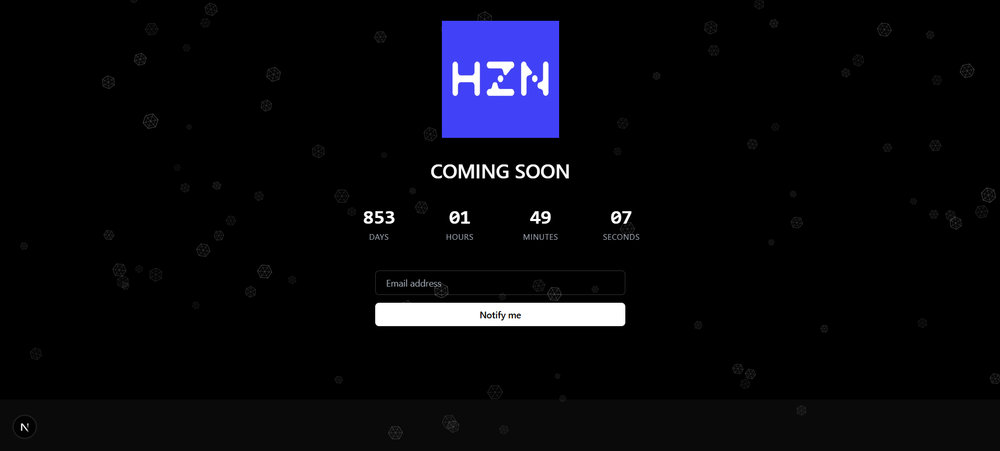

# 🕐 Countdown Timer

A beautiful, animated countdown timer web application built with Next.js 15, React 19, and Tailwind CSS. Perfect for "Coming Soon" pages, product launches, events, or any time-sensitive announcements.

## ✨ Features

- **Real-time countdown** - Live countdown to your target date
- **Responsive design** - Looks great on desktop, tablet, and mobile
- **Animated snowfall effect** - Beautiful background animation
- **Email collection** - Capture user emails for notifications
- **Customizable configuration** - Easy to modify target date and messages
- **Modern tech stack** - Built with the latest Next.js and React
- **TypeScript support** - Fully typed for better development experience
- **Tailwind CSS** - Utility-first CSS framework for rapid styling

## 🚀 Demo 
- [countdown-timer-hzn.vercel.app](https://countdown-timer-hzn.vercel.app)



## 🛠️ Tech Stack

- **Framework:** Next.js 15 (App Router)
- **Frontend:** React 19, TypeScript
- **Styling:** Tailwind CSS
- **Build Tool:** Turbopack (Next.js)
- **Linting:** ESLint

## 📦 Installation

1. **Clone the repository**

   ```bash
   git clone https://github.com/HenGPlayZ/CountdownTimer.git
   cd CountdownTimer
   ```

2. **Install dependencies**

   ```bash
   npm install
   # or
   yarn install
   # or
   pnpm install
   ```

3. **Configure your countdown**

   Edit `config/countdown.ts` to set your target date and customize messages:

   ```typescript
   export const countdownConfig = {
     targetDate: "2027-12-19 00:00:00", // Your target date
     title: "COMING SOON",
     emailPlaceholder: "Email address",
     buttonText: "Notify me",
   };
   ```

4. **Run the development server**

   ```bash
   npm run dev
   # or
   yarn dev
   # or
   pnpm dev
   ```

5. **Open your browser**

   Navigate to [http://localhost:3000](http://localhost:3000) to see your countdown timer.

## 🎨 Customization

### Changing the Target Date

Edit the `targetDate` in `config/countdown.ts`:

```typescript
targetDate: "2025-12-31 23:59:59"; // Format: YYYY-MM-DD HH:mm:ss
```

### Customizing Text

Update the messages in `config/countdown.ts`:

```typescript
title: "Big Sale Coming Soon",
emailPlaceholder: "Enter your email for updates",
buttonText: "Get Notified",
```

### Styling

The app uses Tailwind CSS. You can customize:

- Colors and styling in `app/page.tsx`
- Global styles in `app/globals.css`
- Tailwind configuration in `tailwind.config.ts`

### Adding Your Logo

Replace `public/HZN-blue.jpg` with your own logo image, or update the image source in `app/page.tsx`.

## 🏗️ Project Structure

```
countdown/
├── app/
│   ├── globals.css          # Global styles
│   ├── layout.tsx           # Root layout
│   └── page.tsx             # Main countdown page
├── components/
│   └── Snowfall.tsx         # Animated snowfall component
├── config/
│   └── countdown.ts         # Countdown configuration
├── hooks/
│   └── useCountdown.ts      # Countdown logic hook
├── public/                  # Static assets
└── ...config files
```

## 🚀 Build and Deploy

### Build for Production

```bash
npm run build
npm start
```

### Deploy on Vercel

The easiest way to deploy is using [Vercel](https://vercel.com):

[](https://vercel.com/new/clone?repository-url=https://github.com/HenGPlayZ/CountdownTimer)

### Other Deployment Options

- **Netlify:** Connect your GitHub repo for automatic deployments
- **AWS Amplify:** Deploy with `amplify init` and `amplify publish`
- **Docker:** Use the included Dockerfile for containerized deployment

## 🤝 Contributing

Contributions are welcome! Please feel free to submit a Pull Request.

1. Fork the project
2. Create your feature branch (`git checkout -b feature/AmazingFeature`)
3. Commit your changes (`git commit -m 'Add some AmazingFeature'`)
4. Push to the branch (`git push origin feature/AmazingFeature`)
5. Open a Pull Request

## 📝 License

This project is licensed under the MIT License - see the [LICENSE](LICENSE) file for details.

## 🙏 Acknowledgments

- Built with [Next.js](https://nextjs.org/)
- Styled with [Tailwind CSS](https://tailwindcss.com/)
- Icons and graphics from your favorite design resources

---

⭐ Star this repo if you found it helpful!
